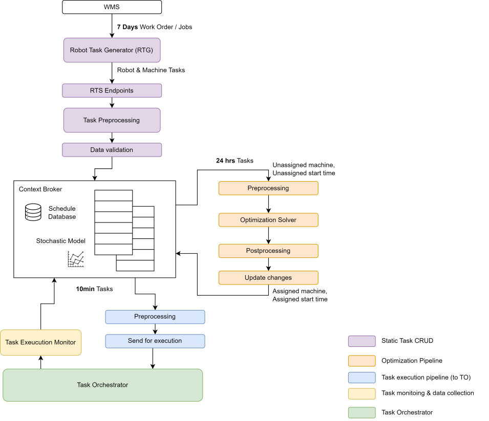

# Scheduler

**Repo:** [`rmf2_scheduler`](https://github.com/ros-industrial/rmf2_scheduler)

> [!WARNING]
> The Scheduler is **not** included in the `ros_industrial_demo` stack yet.
> It will be added in a future release.

## Design

| Components                   | Description                                                                                                                                                                                                                                                                                                                                                                                                                                                                      |
| ---------------------------- | -------------------------------------------------------------------------------------------------------------------------------------------------------------------------------------------------------------------------------------------------------------------------------------------------------------------------------------------------------------------------------------------------------------------------------------------------------------------------------- |
| Robot Task Generator (RTG)   | Generate the robot and machine tasks from work orders / jobs                                                                                                                                                                                                                                                                                                                                                                                                                     |
| RTS Endpoints                | Static CRUD endpoints (REST API) for schedule updates. This allows schedule changes 7 days from now.                                                                                                                                                                                                                                                                                                                                                                             |
| Task Preprocessing           | Add in a rough estimate for the task duration based on previous experience (from stochastic model). Adjust the start time based on task duration and task dependencies.                                                                                                                                                                                                                                                                                                          |
| Data Validation              | Validate the tasks input after the preprocessing before updating the database. This component checks for invalid dependencies, invalid schema, id etc.                                                                                                                                                                                                                                                                                                                           |
| Optimization Pre-processing  | This component takes in all the tasks 24 hrs from now, update their start time based on dependencies and check for any needs for optimization. If optimization is required, this component will create the optimization problem (variables, constraints and objective function) based on the 24 hrs tasks' information. This component can also request for additional information needed for the problem formulation, such as robot states, stochastic model route timing, etc. |
| Optimization Solver          | This is the scheduler optimization solver. It will solve for an optimal solution. If no feasible solution can be found, the solver can provide a best-case alternative.                                                                                                                                                                                                                                                                                                          |
| Optimization Post-processing | Validate the solution from the solver and convert them to schedule updates.                                                                                                                                                                                                                                                                                                                                                                                                      |
| Schedule Changes Update      | Update the schedule in the database with new assignment and new start time.                                                                                                                                                                                                                                                                                                                                                                                                      |
| Execution Pre-processing     | This component takes in all the tasks 10 min from now and convert them to the format for the task orchestrator to execute.                                                                                                                                                                                                                                                                                                                                                       |
| Send for execution           | Send the tasks to the Task Orchestrator for execution.                                                                                                                                                                                                                                                                                                                                                                                                                           |
| Task Execution Monitor       | Upon delay, completion, cancellation or failure during task execution, this component updates the schedule database. Based on these information, the optimization pipeline may be triggered to adjust the schedule. The Stochastic Model also uses this module for operational data collection.                                                                                                                                                                                  |
